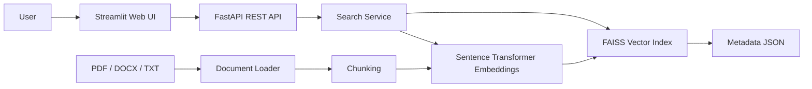

# Architecture

## Components

1. **Document ingestion**: reads `.txt`, `.pdf`, and `.docx` files.
2. **Chunking**: splits content into overlapping word chunks to keep retrieval context manageable.
3. **Embeddings**: converts chunks into normalized dense vectors using `all-MiniLM-L6-v2` by default.
4. **Vector DB**: FAISS `IndexFlatIP` stores vectors and supports fast similarity search.
5. **Ranking**: retrieves semantic candidates and applies a lightweight hybrid score using semantic similarity plus lexical overlap.
6. **REST API**: FastAPI exposes `/health`, `/stats`, and `POST /search`.
7. **Web UI**: Streamlit provides a browser-based enterprise search interface.

## Retrieval flow

`query -> query embedding -> FAISS candidate retrieval -> hybrid re-ranking -> top_k results`

## Design decisions

- **FAISS** is used because it is simple to run locally and is suitable for an evaluation/demo project without a separate database service.
- **Sentence Transformers** provides a ready-to-use semantic embedding model.
- **Hybrid ranking** improves exact term matching without replacing semantic retrieval.
- **JSON metadata** keeps the demo inspectable and easy to debug.
- **FastAPI + Streamlit** keeps backend and UI separated so the REST API can be reused by another client.
